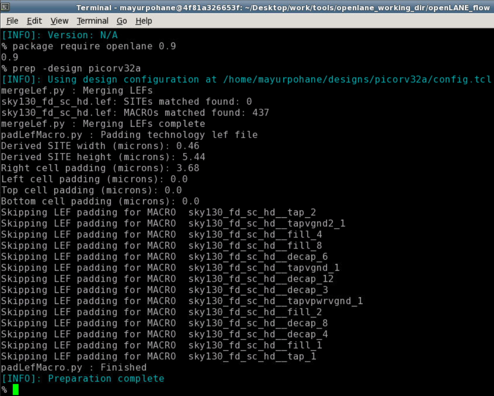

# OpenLANE-Sky130 Physical-Design-Workshop

This repository contains the RTL to GDSII flow implemention using the open-source tool OpenLANE and open-source Sky130 PDK provided by Skywater.

## Table of Contents
- [About](#About)
- [RTL-GDSII Flow](#RTL-GDSII-Flow)
- [Day-1 Opensource EDA, OpenLANE, Skywater130 PDK](#Day-1-Opensource-EDA,-OpenLANE,-Skywater130-PDK)
	- [Introduction Openlane Flow](#Introduction-Openlane-Flow)
	- [Skywater PDK](#Skywater-PDK)
 	- [Invoking OpenLANE](#Invoking-OpenLANE)
 	- [Package Importing](#Package-Importing)
	- [Prepare Design](#Prepare-Design)
 	- [Synthesis](#Synthesis)
	- [Configuration Files](#Configuration-Files)
- [Day-2 Floorplanning and Standard Cells](#Day-2-Floorplanning-and-Standard-Cells)
	- [Aspect Ratio and Utilization Factor](#Aspect-Ratio-and-Utilization-Factor)
	- [Preplaced Cells](#Preplaced-Cells)
	- [Decouping Capacitors](#Decouping-Capacitors)
	- [Power Planning](#Power-Planning)
	- [Pin Placement](#Pin-Placement)
	- [Floorplanning with OpenLANE](#Floorplanning-with-OpenLANE)
	- [Viewing Floorplan in Magic](#Viewing-Floorplan-in-Magic)
	- [Placement](#Placement)
	- [Viewing Placement in Magic](#Viewing-Placement-in-Magic)
	- [Standard Cell Design Flow](#Standard-Cell-Design-Flow)
	- [Standard Cell Characterization](#Standard-Cell-Characterization)
  
- [Day-3 - Design Library Cell](#Day-3-Design-Library-Cell)
	- [Spice Simulations](#Spice-Simulations)
	- [Switching Threshold of a CMOS Inverter](#Switching-Threshold-of-a-CMOS-Inverter)
	- [16 Mask CMOS Process Steps](#16-Mask-CMOS-Process-Steps)
	- [Magic Layout View of Inverter Standard Cell](#Magic-Layout-View-of-Inverter-Standard-Cell)
	- [Magic Key Features](#Magic-Key-Features)
	- [Device Inference](#Device-Inference)
	- [DRC Errors](#DRC-Errors)
	- [PEX Extraction with Magic](#PEX-Extraction-with-Magic)
	- [Spice Wrapper for Simulation](#Spice-Wrapper-for-Simulation)
- [Day-4 Layout Timing Analysis and CTS](#Day-4-Layout-Timing-Analysis-and-CTS)
	- [An Introduciton to LEF Files](#An-Introduciton-to-LEF-Files)
	- [LEF Generation in Magic](#LEF-Generation-in-Magic)
	- [Including Custom Cells in OpenLANE](#Including-Custom-Cells-in-OpenLANE)
	- [Fixing Slack Violations](#Fixing-Slack-Violations)
	- [Clock Tree Synthesis](#SyntheClock-Tree-Synthesissis)
	- [Viewing Post-CTS Netlist](#Viewing-Post-CTS-Netlist)
	- [Post-CTS STA Analysis](#Post-CTS-STA-Analysis)
- [Day-5 Final Steps in RTL to GDSII](#Day-5-Final-Steps-in-RTL-to-GDSII)    
	- [ Power Distribution Network Generation](#Power-Distribution-Network-Generation)
	- [Global and Detailed Routing](#Global-and-Detailed-Routing)
	- [SPEF Extraction](#SPEF-Extraction)
- [Acknowledgement](#acknowledgement)
- [Contact Information](#contact-information)

## About
This project gives an interactive design experience using the open-source tool OpenLANE.
OpenLANE is an automated RTL to GDSII flow that includes other open-source tools like OpenROAD, Yosys, Magic, Netgen, Fault, Open STA, TriRoute. The goal of OpenLANE is to produce GDSII files without any human intervention. OpenLANE is tuned for Skywater 130nm open-source PDK and can be used to develop hard macros and chips.

## RTL to GDSII 
RTL to GDSII design flow is an IC design process that includes different steps such as Chip specification, RTL Synthesis, Floor Planning, Placement, Routing, Verification, etc. An ASIC is designed for a particular use, rather than intended for general-purpose use. And with the help of OpenLANE, you can implement the RTL to GDSII flow with interactive mode as well as non-interactive mode. 

	The inputs to the ASIC flow are-
		1.RTL IP'S
		2.EDA Tools
		3.PDK kits
	
The various stages of flow are as shown below. 

## Day-1-> Inception of Open Source EDA

### Introduction Openlane FLow

OpenLANE flow consists of several steps. All flow steps follow the sequence by default. Each step may consist of multiple sub-steps.The different components in the OpenLANE and their use is stated below.
  
      Yosys        -RTL Synthesis
      abc          -Technology Mapping
      OpenSTA      -Static Timing Analysis
      Fault        -Design for Testability
      OpenROAD     -Physical Design
      TritonCTS    -Clock Distribution
      FastRoute    -Global Routing
      TritonRoute  -Detailed Routing
      SPEFEXTRACT  -SPEF Extraction
      Magic        -GDSII layout,DRC and Antenna Checks
      Netgen       -LVS Checks 
  

### Skywater PDK
The SkyWater Open Source PDK is a collaboration between Google and SkyWater Technology Foundry to provide a fully open source Process Design Kit and related resources, which can be used to create manufacturable designs at SkyWater’s facility. Process Design Kit (PDK) is the interface between the foundry and the CAD designers. The PDK is a set of files used to model the fabrication process for the EDA tools used in designing an IC. PDK’s are generally not available publicly and hence are the limiting factor to open-source Digital ASIC Design. 

### Invoking OpenLane

These are the contents of the OpenLANE flow Directory.

Now to invoke the tool type `./flow.tcl` and to run it in the interactive mode type `./flow.tcl -interactive`.

### Package Importing
Different software dependencies are required to run OpenLANE flow and to import these into the OpenLANE tool we need to run `package require openlane 0.9`
 

### Prepare Design
Prep is used to make file structure for our design. Use `prep -design <design_name>`. here design_name is the name of our design i.e. "picorv32a".
And to save it into a custom named folder use `prep -design <design_name> -tag <foldername>`.
Also the merging of Cell lef and Technology lef takes place in the preperation step and the merged.lef file is generated.

### Synthesis-
To run synthesis use `run_synthesis`.

### Configuration Files
These file contains the Design specs that are used to configure the parameters and initial setting for design.

## Day-2-> Floorplanning and Placement-

### Floorplanning with OpenLANE
To run floorplan in OpenLANE:

As with all other stages, the floorplanning will be run according to configuration settings in the design specific config.tcl file. The output the the floorplanning phase is a DEF file which describes core area and placement of standard cell SITES:

 
The Core area and Die area along with the Design analysis is shown below.

### Viewing Floorplan in Magic
To view our floorplan in Magic we need to provide three files as input:

Magic technology file (sky130A.tech)
Def file of floorplan
Merged LEF file

### Placement
The next step in the Digital ASIC design flow after floorplanning is placement. The synthesized netlist has been mapped to standard cells and floorplanning phase has determined the standard cells rows, enabling placement. OpenLANE does placement in two stages:

Global Placement - Optimized but not legal placement. Optimization works to reduce wirelength by reducing half parameter wirelength
Detailed Placement - Legalizes placement of cells into standard cell rows while adhering to global placement

To do placement in OpenLANE:

For placement to converge the overflow value needs to be converging to 0. At the end of placement cell legalization will be reported:

### Viewing Placement in Magic
To view placement in Magic the command mirrors viewing floorplanning:

## Day 3 Design Library Cell
Git Clonning the vsd folder

Contains of the VSD folder

To invoke the magic 

Magic output

To extract the Spice simulations

Contains of Spice File

Output Waveform of the Inverter

These are the coordinates that are used to calculate the rise fall transaction time

## Day 4 Layout Timing Analysis and CTS

Tracks File

Grids according to the track def

Intersection is taking place in the defined metal area

 
 
 

## Day 5 Final Steps in RTL to GDSII

## Acknowledgements

* [Kunal Ghosh - Co-founder (VSD Corp. Pvt. Ltd)](https://github.com/kunalg123)
* [Nickson Jose - VSD VLSI Engineer](https://github.com/nickson-jose)

## Contact
Mayur Pohane - mayur17pohane@gmail.com

