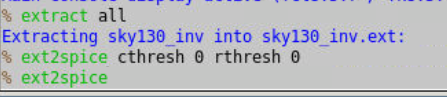

# OpenLANE-Sky130 Physical-Design-Workshop

This repository contains the RTL to GDSII flow implemention using the open-source tool OpenLANE and open-source Sky130 PDK provided by Skywater.

## Table of Contents
- [About](#About)
- [RTL-GDSII Flow](#RTL-GDSII-Flow)
- [Day-1 Opensource EDA, OpenLANE, Skywater130 PDK](#Day-1-Opensource-EDA,-OpenLANE,-Skywater130-PDK)
	- [Introduction Openlane Flow](#Introduction-Openlane-Flow)
	- [Skywater PDK](#Skywater-PDK)
 	- [Invoking OpenLANE](#Invoking-OpenLANE)
 	- [Package Importing](#Package-Importing)
	- [Prepare Design](#Prepare-Design)
 	- [Synthesis](#Synthesis)
	- [Configuration Files](#Configuration-Files)
	
- [Day-2 Floorplanning and Placement](#Day-2-Floorplanning-and-Placement)
	- [Aspect Ratio and Utilization Factor](#Aspect-Ratio-and-Utilization-Factor)
	- [Preplaced Cells](#Preplaced-Cells)
	- [Decouping Capacitors](#Decouping-Capacitors)
	- [Power Planning](#Power-Planning)
	- [Pin Placement](#Pin-Placement)
	- [Floorplanning with OpenLANE](#Floorplanning-with-OpenLANE)
	- [Floorplan in Magic](#Floorplan-in-Magic)
	- [Placement](#Placement)
	- [Placement in Magic](#Viewing-Placement-in-Magic)
	- [Standard Cell Characterization](#Standard-Cell-Characterization)
  
- [Day-3 Design Library Cell and Characterization using Ngspice](#Day-3-Design-Library-Cell-and-Characterization-using-Ngspice)
	- [Git Clonning and Copying Tech File](#Git-Clonning-and-Copying-Tech-File)
	- [Standard Cell in Magic](#Standard-cell-in-Magic)
	- [Extracting Spice File](#Extracting-Spice-File)
	- [Ngspice Simulation](#Ngspice-Simulation)
	- [Characterization of Cell](#Characterization-of-Cell)
	
- [Day-4 Timing Analysis and CTS](#Day-4-Timing-Analysis-and-CTS)
	- [Introduciton to LEF Files](#Introduciton-to-LEF-Files)
	- [LEF Generation](#LEF-Generation)
	- [Including Custom Cells in OpenLANE](#Including-Custom-Cells-in-OpenLANE)
	- [Fixing Slack Violations](#Fixing-Slack-Violations)
	- [Upsizing Buffer](#Upsizing-Buffer)
	- [Clock Tree Synthesis](#SyntheClock-Tree-Synthesissis)
	- [OpenROAD](#OpenROAD)
	
- [Day-5 Routing and SPEF Extraction](#Day-5-Routing-and-SPEF-Extraction)    
	- [Power Distribution Network](#Power-Distribution-Network)
	- [Routing](#Routing)
	- [SPEF Extraction](#SPEF-Extraction)
	- [Modified Netlists](#Modified-Netlists)
- [Acknowledgement](#acknowledgement)
- [Contact Information](#contact-information)

## About
This project gives an interactive design experience using the open-source tool OpenLANE.
OpenLANE is an automated RTL to GDSII flow that includes other open-source tools like OpenROAD, Yosys, Magic, Netgen, Fault, Open STA, TriRoute. The goal of OpenLANE is to produce GDSII files without any human intervention. OpenLANE is tuned for Skywater 130nm open-source PDK and can be used to develop hard macros and chips.

## RTL to GDSII 
RTL to GDSII design flow is an IC design process that includes different steps such as Chip specification, RTL Synthesis, Floor Planning, Placement, Routing, Verification, etc. An ASIC is designed for a particular use, rather than intended for general-purpose use. And with the help of OpenLANE, you can implement the RTL to GDSII flow with interactive mode as well as non-interactive mode. 

	The inputs to the ASIC flow are-
		1.RTL IP'S
		2.EDA Tools
		3.PDK kits
	
The various stages of flow are as shown below. 

## Day-1-> Opensource EDA, OpenLANE, Skywater130 PDK

### Introduction Openlane FLow

OpenLANE flow consists of several steps. All flow steps follow the sequence by default. Each step may consist of multiple sub-steps.The different components in the OpenLANE and their use is stated below.
  
      Yosys        -RTL Synthesis
      abc          -Technology Mapping
      OpenSTA      -Static Timing Analysis
      Fault        -Design for Testability
      OpenROAD     -Physical Design
      TritonCTS    -Clock Distribution
      FastRoute    -Global Routing
      TritonRoute  -Detailed Routing
      SPEFEXTRACT  -SPEF Extraction
      Magic        -GDSII layout,DRC and Antenna Checks
      Netgen       -LVS Checks 
  

### Skywater PDK
The SkyWater Open Source PDK is a collaboration between Google and SkyWater Technology Foundry to provide a fully open source Process Design Kit and related resources, which can be used to create manufacturable designs at SkyWater’s facility. Process Design Kit (PDK) is the interface between the foundry and the CAD designers. The PDK is a set of files used to model the fabrication process for the EDA tools used in designing an IC. PDK’s are generally not available publicly and hence are the limiting factor to open-source Digital ASIC Design. 

### Invoking OpenLane

These are the contents of the OpenLANE flow Directory.

Now to invoke the tool type `./flow.tcl` and to run it in the interactive mode type `./flow.tcl -interactive`.

### Package Importing
Different software dependencies are required to run OpenLANE flow and to import these into the OpenLANE tool we need to run `package require openlane 0.9`
 

### Prepare Design
Prep is used to make file structure for our design. Use `prep -design <design_name>`. here design_name is the name of our design i.e. "picorv32a".
And to save it into a custom named folder use `prep -design <design_name> -tag <foldername>`.
Also the merging of Cell lef and Technology lef takes place in the preperation step and the merged.lef file is generated.

### Synthesis-
To run synthesis use `run_synthesis`.

### Configuration Files
These file contains the Design specs that are used to configure the parameters and initial setting for design.

## Day-2-> Floorplanning and Placement

### Aspect Ratio and Utilization Factor
A chip consists of two parts, core and die. A core is the section of the chip where the fundamental logic of the design is placed. A die, which consists of core, is small semiconductor material specimen on which the fundamental circuit is fabricated
#### Utilization Factor
It is defined as the ratio of area occupied by the netlist to the total area of the core.If the utilization factor is 1,it means the core is completely occupied.

      Utilization Factor = Area occupied by netlist / Total area of core
      
#### Aspect Ratio
It is defined as the ratio of the height of the core to width of the core. If the aspect ratio is 1, it means the core is square.

      Aspect Ratio = Height / Width

### Preplaced Cells
During placement and routing, most of the placement tools, place/move logic cells based on floorplan specifications. Some of the important or critical cell's locations has to be pre-defined before actual placement and routing stages. The critical cells are mostly the cells related to clocks that are clock buffers, clock mux, etc. and also few other cells such as RAM's, ROM,s etc. Since, these cells are placed in to core before placement and routing stage, they are called 'preplaced cells'.

### Decoupling Capacitors
A decoupling capacitor is a capacitor, which is used decouple the critical cells from main power supply, in order to protect the cells from the disturbance occuring in the power distribution lines and source. The purpose of using decoupling capacitors is to deliver current to the gates during switching. The placement of de-coupling capacitors surrounding the pre-placed cells improves the reliability and efficiency of the chip.

### Power Planning
Power planning is essential to lower the noise and also to save the signal from getting faded in digital circuits attributed to voltage drop and ground bounce. Coupling capacitance is formed between the interconnect wires. When a transition occurs on a net, charge associated with coupling capacitors may be dumped to ground. Charge dumps to HIGH/LOW must happen efficiently in the event of a transition, negligence of which leads to accumulation of unwanted charges at the tap, forcing the ground line to behave as a large resistor, lowering the noise margin. The solution to this problem is a robust PDN with many power strap taps which are required to lower the resistance.

### Pin Placement
Pin placement is an essential part of floorplanning to minimize buffering and improve power consumption and timing delays. In pin placement the connectivity information of the HDL netlist is used to determine the I/O placements. Bigger the size of the I/O pin, the lower is the resistance and because of that the clock pins are bigger in size as we need least resistance.

### Floorplanning with OpenLANE
Floorplanning is basically the arrangement of logical blocks (i.e. multiplexer, AND, OR gates, buffers) on silicon chip.
To run floorplan in OpenLANE use `run_floorplan`.

The floorplanning run according to configuration settings in the design specific config.tcl file. The output the the floorplanning phase is a DEF file which describes core area and placement of standard cell SITES:

 
The Core area and Die area along with the Design analysis is shown below.

### Floorplan in Magic
For veiwing the floorplan in Magic we require the input files which are:

		1.Magic technology file (sky130A.tech)
		2.Def file of floorplan
		3.Merged LEF file
		
The command to invoke the Magic Tools is 

                magic -T <magic tech file> lef read <lef file> def read <def file>
		

### Placement
After Floorplanning, the next step is Placement. Placement is the process of finding a suitable physical location for each cell in the block.
Placement does not just place the standard cell available in the synthesized netlist, it also optimized the design
OpenLANE does placement in two stages:

Global Placement - Optimized but not legal placement. Optimization works to reduce wirelength by reducing half parameter wirelength.

Detailed Placement - Legalizes placement of cells into standard cell rows while adhering to global placement

To run placement in OpenLANE use `run_placement`.

For placement to converge the overflow value needs to be converging to 0. At the end of placement cell legalization are reported:

### Placement in Magic
To view placement in Magic go to the placement directory in reults and use

     magic -T <magic tech file> lef read <lef file> def read <def file>

### Standard Cell Characterization
Cell Design consist of following steps-

1. Inputs - PDKs (Process design kits) consist of DRC & LVS rules, SPICE models, library & user-defined specs.

2. Design Steps - Design step include Circuit Design, Layout Design, Characterization.GUNA software is used for characterization. The characterization can be classified as Timing, Power and Noise characterization.

3. Outputs - Outputs of the Design are CDL (Circuit Description Language), GDSII, LEF, extracted Spice netlist (.cir), timing, noise, power.libs, function.

Standard Cell Libraries consist of cells with different functionality/drive strengths. These cells need to be characterized by liberty files to be used by synthesis tools to determine optimal circuit arrangement.
Characterization consist of following steps:

	1.Read Model File.
	2.Extract Spice netlist.
	3.Define behavior of Buffer.
	4.Read subcircuit.
	5.Attach necessary power sources.
	6.Apply Stimulas.
	7.Provide necessary Capacitance.
	8.Provide Simulation commands.

## Day-3-> Design Library Cell and Characterization using Ngspice
### Git Clonning Copying Tech File
The nickson-jose github repo titled `vsdstdcelldesign` was cloned to the local system using the following command 
    
     git clone https://github.com/nickson-jose/vsdstdcelldesign.git

Contains of the VSD directory are:

Since we are using Magic, the tech file is required, (here sky130A.tech), which is present in the openlane_working_dir/pdks/sky130A/libs.tech/magic folder, so we need to copy it to the vsd directory. Use `cp sky130A.tech /Desktop/work/tools/openlane_working_dir/openLANE_flow/vsdstdcelldesign`

### Standard Cell in Magic

To invoke the magic use 
    
     magic -T sky130A.tech sky130_inv.mag &
     
Magic output

### Extracting Spice File

To extract the Spice simulations file use these following commands
  	
	%extract all
	%ext2spice cthresh 0 rthresh 0
	&ext2spice
These three commands will generate the `spice` file and `.ext` file. and it is reflected in the vsd directory.

Contains of Spice File

### Ngspice Simulation

To run the simulation with ngspice, invoke the ngspice tool with the spice file as input:
 
    $ ngspice sky130_inv.spice
 

 To geneate Output Waveform of the Inverter use following command in ngspice.
   
    plot y vs time a

### Characterization of Cell 

The above plot can be used to compute the rise time, fall time and propagation delay. Calculating the values of these parameters is called as characterization of the cell. They are:-

Rise Time - This is defined as the time taken for the signal to go from 20% to 80%. It was found to be 0.0637 ns.
      

Fall Time -This is defined as the time taken for the signal to go from 80% to 20%.  It was found to be 0.04237 ns

     

Propogation Delay - This is defined as the time difference between the points where the input and output are at 50% of their magnitude. It's experimentally found to be 0.027 ns

## Day-4-> Timing Analysis and CTS

### Introduction to LEF Files
The LEF file is the abstract view of cells. It gives idea about PR boundary, pin position and metal layer information of a cell. 

Technology LEF - Contains layer information, via information, and restricted DRC rules

Cell LEF - Abstract information of standard cells

Guidelines for making Standard Cell set:

	1.Input and output port must lie on interconnect of vertical and horizontal tracks. 
	2.Width of standard cell should be odd multiple of track horizontal pitch 
	3.Height of standard cell should be odd multiple of track vertical pitch.

Tracks File:

Grids according to the track defination are reflected in the below image.To display grid use `grid 0.46um 0.34um 0.23um 0.17um`. These values are taken from the track file.
  

All the criteria of the standard cell set are meet here.

 
Save the mag file as shown below.
 

### LEF Generation

Magic allows to generate cell LEF. To generate the cell LEF file from Magic perform `lef write`.

### Including Custom Cells in OpenLANE
Now we will include the standard cell (inverter) which we created in the above steps in the picorv32a dsesign.

To do that, we make some changes in the config.tcl file.
Here's how the config.tcl file looks finally :-

Now we will again run the `./flow.tcl -interactive` command and will include the package `package require openlane 0.9` and prepare the design using `prep -design <design_name> -tag <tag_name> -overwrite` Here we will overwrite the previous files with the help of `-overwrite`.

Additional statements to include extra LEF Files:

    set lefs [glob $::env(DESIGN_DIR)/src/*.lef]
    add_lefs -src $lefs
    
After adding additional lef files run synthesis `run_synthesis`.
  

Once the synthesis is completed, Check tns and wns values, it shows the slack violations.

Run Floorplan, Placement and invoke the magic.Use below commands.

      % run_floorplan
      % run_synthesis
      % magic -T <magic tech file> lef read <lef file> def read <def file>

Upon zooming into the design, we can see our standard cell.

With the help of `expand` command you can see the layout.

### Fixing Slack Violations
Upon running synthesis, it can be seen that the setup and hold slacks are both negative. This indicates Violation.
`pre_sta.conf` file was created.And to run the sta use `sta pre_sta.conf`.

To reduce slack, fanout is reduced to 4

Slack after updated fanout.

### Upsizing Buffers

Fanout updation was not that effeftive so now we resize the bufeers to reduce the slack.But upsizing the buffers also increases the area of chip.
This modification can be done as follows:- `replace_cell _<net_number>_ <name_of_buffer>`.

Slack after updating the buffer size.

### Clock Tree Synthesis
After running floorplan and placement in OpenLANE, now we will add the clock tree. Two main concerns with generation of the clock tree are:

Clock skew - Difference in arrival times of the clock for sequential elements across the design

Delta delay - Skew introduced through capacitive coupling of the clock tree nets

To run clock tree synthesis (CTS) in OpenLANE use `run_cts`.

A new synthesis file will be genearted in the results synthesis folder.

### OpenROAD
In OpenROAD the timing analysis is done by creating a .db file. This database file is created from the post-cts LEF and DEF files. Invoke OpenROAD using `openroad` command.

Execute the following commands for timing analysis:-

	% write_db pico_cts.db
	% read_db pico_cts.db
	% read_lef <Location_of_LEF_file>
	% read_def <Location_of_DEF_file> 
	% read_verilog <Location_of_verilog_file> 
	% read_liberty $::env(LIB_SYNTH_COMPLETE)
	% link_design <design_name> 
	% read_sdc <Location_of_sdc_file>
	% set_propagated_clock [all_clocks]
	% report_checks -path_delay min_max -format full_clock_expanded -digits 4
	
Below images are the implementation of above commands.

Here we can see that now the timing requirements are meet.

## Day-5-> Routing and SPEF Extraction

### Power Distribution Network

The PDN feature within OpenLANE will create:

	1.Power ring global to the entire core
	2.Power halo local to any preplaced cells
	3.Power straps to bring power into the center of the chip
	4.Power rails for the standard cells
	
To generate the PDN in OpenLANE use `gen_pdn`

### Routing
OpenLANE uses TritonRoute as the routing engine for physical implementations of designs. Routing consists of two stages:

Global Routing - Routing guides are generated for interconnects on our netlist defining what layers, and where on the chip each of the nets will be reputed

Detailed Routing - Metal traces are iteratively laid across the routing guides to physically implement the routing guides.

To run routing in OpenLANE use `run_routing`.

TritonRoute offers multiple routing strategies which have their own pros and cons. The two main strategies adopted are "0" and "14" (also called TritonRoute14).We are using Routing Strategy `0` here. One can understand which strategy is put into place by executing `% echo $::env(ROUTING_STRATEGY)` in OpenLANE. By default, OpenLANE executes strategy 0.

Routing Completed:

Here you can see the no of violations in the routing.Violations can be reduced using diffrent strategy which take more time to execute.

### SPEF Extraction

The SPEF EXTRACTOR is yet to be integrated to OpenLANE so we have to Navigate to the tools directory, there SPEF_Extractor can be find. We have to run the python file named `main.py` in SPEF_EXTRACTOR directory. The command to do this is as folows:
		
	$ python3 main.py /designs/picorv32a/runs/<tag_name>/tmp/merged.lef /designs/picorv32a/runs/<tag_name>/results/routing/picorv32a.def

The SPEF file is then written into the routing directory under results as can be seen here:-

### Modified Netlists
At diffrent stages, the original netlist we worked were modified and added subsequently to the synthesis folder because each stage is responsible for performing certain actions which optimises the design and keep the physcial design flow smooth and running.

## Acknowledgements

* [Kunal Ghosh - Co-founder (VSD Corp. Pvt. Ltd)](https://github.com/kunalg123)
* [Nickson Jose - VSD VLSI Engineer](https://github.com/nickson-jose)

## Contact
Mayur Pohane - mayur17pohane@gmail.com

