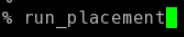

# OpenLANE-Sky130 Physical-Design-Workshop

This repository contains the RTL to GDSII flow implemention using the open-source tool OpenLANE and open-source Sky130 PDK provided by Skywater.

# Table of Contents
- [About](#About)
- [RTL-GDSII Flow](#RTL-GDSII-Flow)
- [Day-1 Opensource EDA, OpenLANE, Skywater130 PDK](#Day-1-Opensource-EDA,-OpenLANE,-Skywater130-PDK)
	- [Introduction Openlane Flow](#Introduction-Openlane-Flow)
 	- [Invoking OpenLANE](#Invoking-OpenLANE)
 	- [Package Importing](#Package-Importing)
 	- [Design Folder](#Design-Folder)
 	- [Design Folder Hierarchy](#Design-Folder-Hierarchy) 
	- [Configuration Files](#Configuration-Files)
	- [Prepare Design](#Prepare-Design)
 	- [Synthesis](#Synthesis)
- [Day-2 Floorplanning and Standard Cells](#Day-2-Floorplanning-and-Standard-Cells)
	- [Aspect Ratio and Utilization Factor](#Aspect-Ratio-and-Utilization-Factor)
	- [Preplaced Cells](#Preplaced-Cells)
	- [Decouping Capacitors](#Decouping-Capacitors)
	- [Power Planning](#Power-Planning)
	- [Pin Placement](#Pin-Placement)
	- [Floorplanning with OpenLANE](#Floorplanning-with-OpenLANE)
	- [Viewing Floorplan in Magic](#Viewing-Floorplan-in-Magic)
	- [Placement](#Placement)
	- [Viewing Placement in Magic](#Viewing-Placement-in-Magic)
	- [Standard Cell Design Flow](#Standard-Cell-Design-Flow)
	- [Standard Cell Characterization](#Standard-Cell-Characterization)
  
- [Day-3 - Design Library Cell](#Day-3-Design-Library-Cell)
	- [Spice Simulations](#Spice-Simulations)
	- [Switching Threshold of a CMOS Inverter](#Switching-Threshold-of-a-CMOS-Inverter)
	- [16 Mask CMOS Process Steps](#16-Mask-CMOS-Process-Steps)
	- [Magic Layout View of Inverter Standard Cell](#Magic-Layout-View-of-Inverter-Standard-Cell)
	- [Magic Key Features](#Magic-Key-Features)
	- [Device Inference](#Device-Inference)
	- [DRC Errors](#DRC-Errors)
	- [PEX Extraction with Magic](#PEX-Extraction-with-Magic)
	- [Spice Wrapper for Simulation](#Spice-Wrapper-for-Simulation)
- [Day-4 Layout Timing Analysis and CTS](#Day-4-Layout-Timing-Analysis-and-CTS)
	- [An Introduciton to LEF Files](#An-Introduciton-to-LEF-Files)
	- [LEF Generation in Magic](#LEF-Generation-in-Magic)
	- [Including Custom Cells in OpenLANE](#Including-Custom-Cells-in-OpenLANE)
	- [Fixing Slack Violations](#Fixing-Slack-Violations)
	- [Clock Tree Synthesis](#SyntheClock-Tree-Synthesissis)
	- [Viewing Post-CTS Netlist](#Viewing-Post-CTS-Netlist)
	- [Post-CTS STA Analysis](#Post-CTS-STA-Analysis)
- [Day-5 Final Steps in RTL to GDSII](#Day-5-Final-Steps-in-RTL-to-GDSII)    
	- [ Power Distribution Network Generation](#Power-Distribution-Network-Generation)
	- [Global and Detailed Routing](#Global-and-Detailed-Routing)
	- [SPEF Extraction](#SPEF-Extraction)
- [Acknowledgement](#acknowledgement)
- [Contact Information](#contact-information)

# About
This project gives an interactive design experience using the open-source tool OpenLANE.
OpenLANE is an automated RTL to GDSII flow that includes other open-source tools like OpenROAD, Yosys, Magic, Netgen, Fault, Open STA, TriRoute. The goal of OpenLANE is to produce GDSII files without any human intervention. OpenLANE is tuned for Skywater 130nm open-source PDK and can be used to develop hard macros and chips.

# RTL to GDSII 
RTL to GDSII design flow is an IC design process that includes different steps such as Chip specification, RTL Synthesis, Floor Planning, Placement, Routing, Verification, etc. An ASIC is designed for a particular use, rather than intended for general-purpose use. And with the help of OpenLANE, you can implement the RTL to GDSII flow with interactive mode as well as non-interactive mode. 

	The inputs to the ASIC flow are-
		1.RTL IP'S
		2.EDA Tools
		3.PDK kits
	
The various stages of flow are as shown below. 

# Day 1 Inception of Open Source EDA

# Introduction Openlane FLow

OpenLANE flow consists of several steps. All flow steps follow the sequence by default. Each step may consist of multiple sub-steps.
  
      Yosys -RTL Synthesis
      abc - Technology Mapping
      OpenSTA - Static Timing Analysis
      Fault – Design for Testability
      OpenROAD-Physical Design
      FastRoute - Global Routing
      TritonRoute - Detailed Routing
      DEF2SPEF - SPEF Extraction
      Magic - GDSII layout,DRC and Antenna Checks
      Netgen - LVS Checks 
  

# Skywater PDK
Process Design Kit (PDK) is the interface between the CAD designers and the foundry. The PDK is a collection of files used to model a fabrication process for the EDA tools used in designing an IC. PDK’s are traditionally closed-source and hence are the limiting factor to open-source Digital ASIC Design. Google and Skywater have broken this stigma and published the world’s first open-source PDK on June 30th, 2020. This breakthrough has been a catalyst for open-source EDA tools. This workshop focuses on using the open-source RTL2GDS EDA tool, OpenLANE, in conjunction with the Skywater 130nm PDK to perform the full RTL2GDS flow as shown below:

# Invoking OpenLane

./flow.tcl is the script which runs the OpenLANE flow
OpenLANE can be run interactively or in autonomous mode
To run interactively, use the -interactive option with the ./flow.tcl script

Package Importing
Different software dependencies are needed to run OpenLANE. To import these into the OpenLANE tool we need to run:

Design Folder
All designs run within OpenLANE are extracted from the openlane/designs folder:

Design Folder Hierarchy

Each design hierarchy comes with two distinct components:

Src folder - Contains verilog files and sdc constraint files
Config.tcl files - Design specific configuration switches used by OpenLANE

An example of a configuration file is given:

Prepare Design
Prep is used to make file structure for our design. To set this up do:

After running this look in the openlane/design/picro32a folder and you will see there is a new directory structure created in this folder under the runs folder so to enable OpenLANE flow:

The config.tcl file shown in this folder contains all the parameters used by OpenLANE for this specific run.
In addition, preparing the design in OpenLANE merges the technology LEF and cell LEF information. Technology LEF information contains layer definitions and a set of restricted design rules needed for PnR flow. The cell LEF contains obstruction information of each standard cell needed to minimize DRC errors during PnR flow:

Synthesis
To run synthesis:

Note: Ensure the WNS is an acceptable number, if not please adjust the clock period to fix STA errors.

# Day 2 Chip Floorplanning and Standard Cells

In Floorplanning we typically set the:

Die Area
Core Area
Core Utilization
Aspect Ratio
Place Macros
Power distribution network (Normally done here but done later in OpenLANE)
Place input and output pins

Aspect Ratio and Utilization Factor
Two key descriptions of a floorplan are utilization and aspect ratio. The amount of area of the die core the standard cells are taking up is called utilization. Normally we go for 50-70% utilization to, or utilization factor of 0.5-0.7. Keeping within this range allows for optimization of placement and realizable routing of a system. Aspect ratio can specify the shape of your chip by the height of the core area divided by the width of the core area. An aspect ratio of 1 discribes the chip as a square.

Preplaced Cells
Preplaced cells, or MACRO’s, are important to enable hierarchical PnR flow. Preplaced cells enable VLSI engineers to granularize a larger design. In floorplanning we define locations and blockages for preplaced cells. Blockages are needed to ensure no standard cells are mapped where the placeplaced cells are located.

Decoupling Capacitors
Decoupling capacitors are placed local to preplaced cells during Floorplanning. Voltage drops associated with interconnect wires can heavily affect our noise margin or put it into an indeterminate state. Decoupling capacitor is a big capacitor located next to the macros to fix this problem. The capacitor will charge up to the power supply voltage over time and it will work as a charge reservoir when a transition is needed by the circuit instead of the charge coming from the power supply. Therefore it “decouples” the circuit from the main supply. The capacitor acts like the power supply.

Power Planning
Power planning during the Floorplanning phase is essential to lower noise in digital circuits attributed to voltage droop and ground bounce. Coupling capacitance is formed between interconnect wires and the substrate which needs to be charged or discharged to represent either logic 1 or logic 0. When a transition occurs on a net, charge associated with coupling capacitors may be dumped to ground. If there are not enough ground taps charge will accumulate at the tap and the ground line will act like a large resistor, raising the ground voltage and lowering our noise margin. To bypass this problem a robust PDN with many power strap taps are needed to lower the resistance associated with the PDN.

Pin Placement
Pin placement is an essential part of floorplanning to minimize buffering and improve power consumption and timing delays. The goal of pin placement is to use the connectivity information of the HDL netlist to determine where along the I/O ring a specific pin should be placed. In many cases, optimal pin placement will be accompanied with less buffering and therefore less power consumption. After pin placement is formed we need to place logical cell blockages along the I/O ring to discriminate between the core area and I/O area.

Floorplanning with OpenLANE
To run floorplan in OpenLANE:

As with all other stages, the floorplanning will be run according to configuration settings in the design specific config.tcl file. The output the the floorplanning phase is a DEF file which describes core area and placement of standard cell SITES:

Viewing Floorplan in Magic
To view our floorplan in Magic we need to provide three files as input:

Magic technology file (sky130A.tech)
Def file of floorplan
Merged LEF file

Placement
The next step in the Digital ASIC design flow after floorplanning is placement. The synthesized netlist has been mapped to standard cells and floorplanning phase has determined the standard cells rows, enabling placement. OpenLANE does placement in two stages:

Global Placement - Optimized but not legal placement. Optimization works to reduce wirelength by reducing half parameter wirelength
Detailed Placement - Legalizes placement of cells into standard cell rows while adhering to global placement

To do placement in OpenLANE:

For placement to converge the overflow value needs to be converging to 0. At the end of placement cell legalization will be reported:

Viewing Placement in Magic
To view placement in Magic the command mirrors viewing floorplanning:

Standard Cell Design Flow
Cell design is done in 3 parts:

Inputs - PDKs (Process design kits), DRC & LVS rules, SPICE models, library & user-defined specs.
Design Steps - Design steps of cell design involves Circuit Design, Layout Design, Characterization. The software GUNA used for characterization. The characterization can be classified as Timing characterization, Power characterization and Noise characterization.
Outputs - Outputs of the Design are CDL (Circuit Description Language), GDSII, LEF, extracted Spice netlist (.cir), timing, noise, power.libs, function.

Standard Cell Characterization
Standard Cell Libraries consist of cells with different functionality/drive strengths. These cells need to be characterized by liberty files to be used by synthesis tools to determine optimal circuit arrangement. The open-source software GUNA is used for characterization.
Characterization is a well-defined flow consisting of the following steps:

Link Model File of CMOS containing property definitions
Specify process corner(s) for the cell to be characterized
Specify cell delay and slew thresholds percentages
Specify timing and power tables
Read the parasitic extracted netlist
Apply input or stimulus
Provide necessary simulation commands

# Day 3 Design Library Cell

OpenLANE has the benefit of allowing changes to internal switches of the ASIC design flow on the fly. This allows users to experiment with floorplanning and placement without having to reinvoke the tool.

Spice Simulations
To simulate standard cells spice deck wrappers will need to be created around our model files.
SPICE deck will comprise of:

Model include statements
Component connectivity, including substrate taps
Output load capacitance
Component values
Node names
Simulation commands

To plot the output waveform of the spice deck we will use ngspice. The steps to run the simulation on ngpice are as follows:

Source the .cir spice deck file
Run the spice file by: run
Run: setplot → allows you to view any plots possible from the simulations specified in the spice deck
Select the simulation desired by entering the simulation name in the terminal
Run: display to see nodes available for plotting
Run: plot  vs  to obtain output waveform

Switching Threshold of a CMOS Inverter
CMOS cells have three modes of operation:

Cutoff - No inversion
Triode - Inversion but no pinchoff in channel
Saturation - Inversion and pinchoff in channel

The voltages at which the switch between the modes of operation happens is dependent on the threshold voltage of the device(s). Threshold voltage is a function of the W/L ratio of a device, therefore varying the W/L ratio will vary the output waveform of CMOS devices.
To enable efficient description of the varying waveforms a single parameter called switching threshold is used. Switching threshold is defined at the intersection of Vin = Vout. A perfectly symmetrical device will have a switching threshold such that Vin = Vout = VDD/2.

16 Mask CMOS Process Steps

Substrate Selection : Selection of base layer on which other regions will be formed.
Create an active region for transistors : SiO2 and Si3N2 deposited. Pockets created using photoresist and lithography.
Nwell & Pwell formation : Pwell uses boron and nwell uses phosphorus. Drive in diffusion by placing it in a high temperature furnace.
Creating Gate terminal : For desired threshold value NA (doping Concentration) and Cox to be set.
Lightly Doped Drain (LDD) formation : LDD done to avoid hot electron effect and short channel effect.
Source and Drain formation : Forming the source and drain.
Contacts & local interconnect Creation : SiO2 removed using HF etch. Titanium deposited using sputtering.
Higher Level metal layer formation : Upper layers of metals deposited.

Magic Layout View of Inverter Standard Cell
Refer to: https://github.com/nickson-jose/vsdstdcelldesign for cell files.
For easier access to critical files within the lab I suggest doing the following:

Sudo pluma /etc/environment (can open with preferred document viewer)
Add the following variables to the file:

Replace the file locations as specified in your user hierarchy
To invoke Magic:

Magic Key Features:

Color Palette - Defines layers and associated colors
Continuous DRC
Device Inference - Automatic recognition of NMOS and PMOS devices

Device Inference
Select the specific layer/device by hovering over the object and pressing, s, iteratively, until you traverse the hierarchy to the specified object:

Run the what command in the tkcon window:

DRC Errors
DRC errors in magic will be highlighted with white dotted lines:

DRC checks are continuous in Magic, therefore the designer may ensure the design is DRC free during creation instead of performing the iterative DRC checks when the cell layout is completed.
To identify DRC errors select DRC find next error:

The associated DRC error will be displayed in the tkcon window:

For more information on DRC errors plase refer to: https://skywater-pdk--136.org.readthedocs.build/en/136/
For more information on how to fix these DRC errors using Magic please refer to: http://opencircuitdesign.com/magic/

PEX Extraction with Magic
To extract the parasitic spice file for the associated layout one needs to create an extraction file:

After generating the extracted file we need to output the .ext file to a spice file:

Spice Wrapper for Simulation

To run the simulation with ngspice, invoke the ngspice tool with the spice file as input:

The plot can be viewed by plotting the output vs time while sweeping the input:

# Day 4 Layout Timing Analysis and CTS

Place and routing (PnR) is performed using an abstract view of the GDS files generated by Magic. The abstract information will include metal and pin information. The PnR tool will use the abstract view information, formally defined as LEF information, to perform interconnect routing in conjunction to routing guides generated from the PnR flow.

An Introduction to LEF Files

Technology LEF - Contains layer information, via information, and restricted DRC rules
Cell LEF - Abstract information of standard cells

Tracks are used during the routing stage, routes can go over the tracks, or metal traces can go over the tracks. What the file is saying is that for the li1 layer the x or horizontal track is at an offset of 0.23 and a pitch of 0.46. The offset is the distance from the origin to the routing track in either the x or y direction. It is half the pitch so that means the tracks are centered around the origin.

Standard Cell Pin Placement
On-track standard cell pin placement is essential for DRC free PnR flow. Pins must align with the li1 and met1 preferred routing directions. During standard cell creation this concept must be accounted for. To ensure a cell is aligned with routing grids in Magic we can display a grid on top of the gds file.
To display the grid in magic:

Viewing the grid we can ensure our pin placement is optimized for PnR flow:

LEF Generation in Magic
Magic allows users to generate cell LEF information directly from the Magic terminal. To generate the cell LEF file from Magic perform:

Generated cell LEF file:
Including Custom Cells in OpenLANE
In order to include the new cells in OpenLANE we need to do some initial configuration:

Fully characterize new cell with GUNA for specified corners
Include cell level liberty file in top level liberty file
Reconfigure synthesis switches in the config.tcl file:

Note: This step will also include any extra LEF files generated for the custom standard cell(s)
Overwrite previous run to include new configuration switches:

Overwrite previous run to include new configuration switches:

Add additional statements to include extra cell LEFs:

Check synthesis logs to ensure cell has been integrated correctly

Fixing Slack Violations
VLSI engineers will obtain system specifications in the architecture design phase. These specifications will determine a required frequency of operation. To analyze a circuit's timing performance designers will use static timing analysis tools (STA). When referring to pre clock tree synthesis STA analysis we are mainly concerned with setup timing in regards to a launch clock. STA will report problems such as worst negative slack (WNS) and total negative slack (TNS). These refer to the worst path delay and total path delay in regards to our setup timing restraint. Fixing slack violations can be debugged through performing STA analysis with OpenSTA, which is integrated in the OpenLANE tool. To describe these constraints to tools such as In order to ensure correct operation of these tools two steps must be taken:

Design configuration files (.conf) - Tool configuration files for the specified design
Design Synopsys design constraint (.sdc) files - Industry standard constraints file

For the design to be complete, the worst negative slack needs to be above or equal to 0. If the slack is outside of this range we can do one of multiple things:

Review our synthesis strategy in OpenLANE
Enable cell buffering
Perform manual cell replacement on our WNS path with the OpenSTA tool
Optimize the fanout value with OpenLANE tool

To invoke OpenSTA with the configuration file:

Cell Fanout Example:

The delay of this cell is large due to a high load capacitance due to high fanout. To fix this problem we can re-run synthesis within OpenLANE after reconfiguring the maximum fanout load value.

Cell Replacement Example:

To determine what loads our net is driving in OpenSTA we can report net connecitons:

To increase the drive strength of our buffer:

After performing this optimization we can use the write_verilog command of OpenSTA to output the improved netlist for use in the OpenLANE flow:

Clock Tree Synthesis
After running floorplan and standard cell placement in OpenLANE we are ready to insert our clock tree for sequential elements in our design. Two of the main concerns with generation of the clock tree are:

Clock skew - Difference in arrival times of the clock for sequential elements across the design
Delta delay - Skew introduced through capacitive coupling of the clock tree nets

To run clock tree synthesis (CTS) in OpenLANE:

Note: To ensure timing constraints CTS will add buffers throughout the clock tree which will modify our netlist

Viewing Post-CTS Netlist
OpenLANE will generate a new .def file containing information of our design after CTS is performed. To view this netlist we need to invoke the .def file with the Magic tool:

Post-CTS STA Analysis
OpenLANE has the OpenROAD application integrated into its flow. The OpenROAD application has OpenSTA integrated into its flow. Therefore, we can perform STA analysis from within OpenLANE by invoking OpenROAD.
To invoke OpenROAD from OpenLANE:

In OpenROAD the timing analysis is done by creating a .db database file. This database file is created from the post-cts LEF and DEF files. To generate the .db files within OpenROAD:

Note: Whenever the DEF file changes we need to recreate this .db file
After .db generation users can perform tool configuration followed by reporting the propagated clock timing analysis:

# Day 5 Final Steps in RTL to GDSII

After generating our clock tree network and verifying post routing STA checks we are ready to generate the power distribution network in OpenLANE:

Power Distribution Network Generation
To generate the PDN in OpenLANE:

The PDN feature within OpenLANE will create:

Power ring global to the entire core
Power halo local to any preplaced cells
Power straps to bring power into the center of the chip
Power rails for the standard cells

Note: The pitch of the metal 1 power rails defines the height of the standard cells

Global and Detailed Routing
OpenLANE uses TritonRoute as the routing engine for physical implementations of designs. Routing consists of two stages:

Global Routing - Routing guides are generated for interconnects on our netlist defining what layers, and where on the chip each of the nets will be reputed
Detailed Routing - Metal traces are iteratively laid across the routing guides to physically implement the routing guides

To run routing in OpenLANE:

If DRC errors persist after routing the user has two options:

Re-run routing with higher QoR settings
Manually fix DRC errors specific in tritonRoute.drc file

SPEF Extraction
After routing has been completed interconnect parasitics can be extracted to perform sign-off post-route STA analysis. The parasitics are extracted into a SPEF file. The SPEF extractor is not included within OpenLANE as of now.

# Acknowledgements

* [Kunal Ghosh - Co-founder (VSD Corp. Pvt. Ltd)](https://github.com/kunalg123)
* [Nickson Jose - VSD VLSI Engineer](https://github.com/nickson-jose)
# Contact
Mayur Pohane - mayur17pohane@gmail.com

