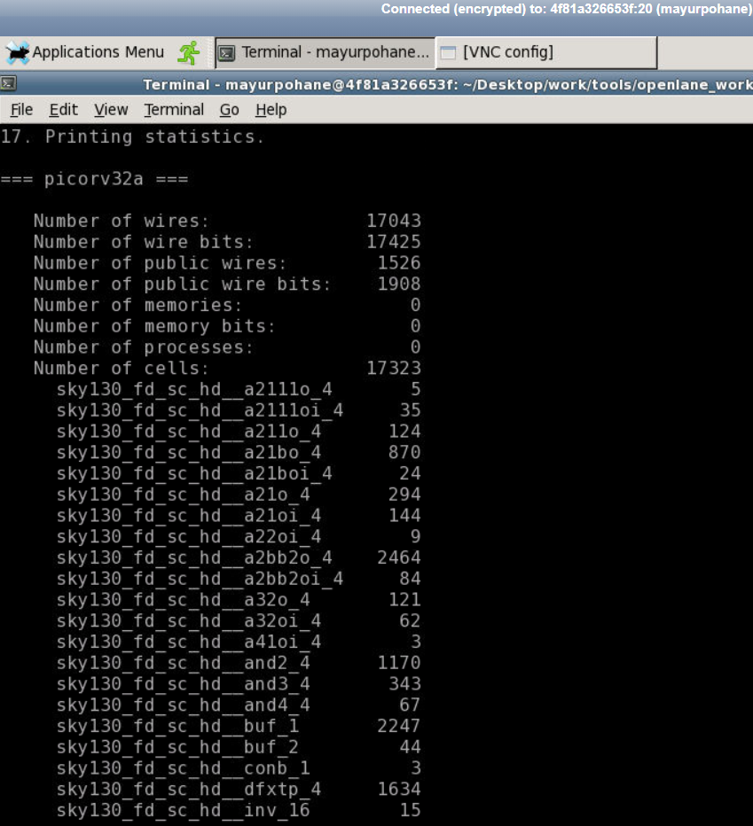
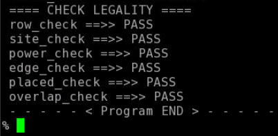

# OpenLANE-Sky130 Physical-Design-Workshop

This repository contains the RTL to GDSII flow implemention using the open-source tool OpenLANE and open-source Sky130 PDK provided by Skywater.

# Table of Contents
- [About](#About)
- [RTL-GDSII Flow](#RTL-GDSII Flow)
- [Day-1 Opensource EDA, OpenLANE, Skywater130 PDK](#Day-1 Opensource EDA, OpenLANE, Skywater130 PDK)
	- [Skywater PDK Files](#Skywater PDK Files)
 	- [Invoking OpenLANE](#Invoking OpenLANE)
 	- [Package Importing](#Package Importing)
 	- [Design Folder](#tips-for-ip-design-using-sky130-technology)
 	- [Design Folder Hierarchy](#Design Folder Hierarchy) 
	- [Configuration Files](#Configuration Files)
	- [Prepare Design](#Prepare Design)
 	- [Synthesis](#Synthesis)
- [Day-2 Floorplanning and Standard Cells](#Day-2 Floorplanning and Standard Cells)
	- [Aspect Ratio and Utilization Factor](#Aspect Ratio and Utilization Factor)
 	- [Preplaced Cells](#Preplaced Cells)
 	- [Decouping Capacitors](#Decouping Capacitors)
  - [Power Planning](#Power Planning)
  - [Pin Placement](#Pin Placement)
  - [Floorplanning with OpenLANE](#Floorplanning with OpenLANE)
  - [Viewing Floorplan in Magic](#Viewing Floorplan in Magic)
 	- [Placement](#Placement)
  - [Viewing Placement in Magic](#Viewing Placement in Magic)
 	- [Standard Cell Design Flow](#Standard Cell Design Flow)
  - [Standard Cell Characterization](#Standard Cell Characterization)
  
- [Day 3 - Design Library Cell](#Day 3 - Design Library Cell)
 	- [Spice Simulations](#Spice Simulations)
  - [Switching Threshold of a CMOS Inverter](#Switching Threshold of a CMOS Inverter)
  - [16 Mask CMOS Process Steps](#16 Mask CMOS Process Steps)
  - [Magic Layout View of Inverter Standard Cell](#Magic Layout View of Inverter Standard Cell)
  - [Magic Key Features](#Magic Key Features)
  - [Device Inference](#Device Inference)
  - [DRC Errors](#DRC Errors)
  - [PEX Extraction with Magic](#PEX Extraction with Magic)
  - [Spice Wrapper for Simulation](#Spice Wrapper for Simulation)
- [Day-4 Layout Timing Analysis and CTS](#Day-4 Layout Timing Analysis and CTS)
  - [An Introduciton to LEF Files](#An Introduciton to LEF Files)
  - [LEF Generation in Magic](#LEF Generation in Magic)
  - [Including Custom Cells in OpenLANE](#Including Custom Cells in OpenLANE)
  - [Fixing Slack Violations](#Fixing Slack Violations)
  - [Clock Tree Synthesis](#SyntheClock Tree Synthesissis)
  - [Viewing Post-CTS Netlist](#Viewing Post-CTS Netlist)
  - [Post-CTS STA Analysis](#Post-CTS STA Analysis)
- [Day 5 Final Steps in RTL to GDSII](#Day 5 Final Steps in RTL to GDSII)    
  - [ Power Distribution Network Generation](# Power Distribution Network Generation)
  - [Global and Detailed Routing](#Global and Detailed Routing)
  - [SPEF Extraction](#SPEF Extraction)
- [Acknowledgement](#acknowledgement)
- [Contact Information](#contact-information)

